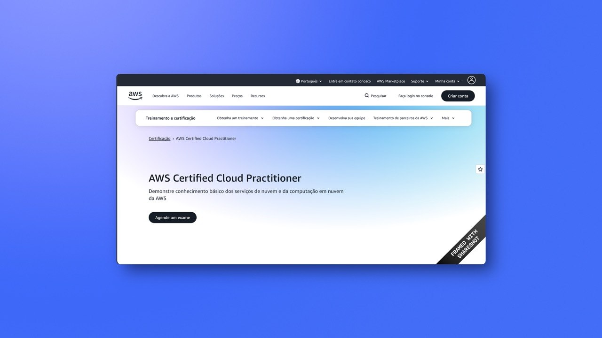

# Resumo do Curso AWS Certified Cloud Practitioner (CLF-C02)

Este repositório contém resumos detalhados para a certificação **AWS Certified Cloud Practitioner (CLF-C02)**, baseados no conteúdo oficial e nas melhores práticas da AWS.

## Estrutura dos Tópicos

Os resumos estão divididos nos seguintes arquivos:

1.  **[Conceitos da Nuvem](./resumos/01-conceitos-nuvem.md)**
    - Vantagens da Nuvem AWS.
    - Modelos de Nuvem (PaaS, IaaS, SaaS).
    - Infraestrutura Global da AWS.
2.  **[Segurança e Conformidade](./resumos/02-seguranca-conformidade.md)**
    - Modelo de Responsabilidade Compartilhada.
    - IAM (Identity and Access Management).
    - Melhores práticas de segurança.
3.  **[Tecnologia e Serviços Principais](./resumos/03-tecnologia-servicos-principais.md)**
    - Computação (EC2, Lambda).
    - Armazenamento (S3, EBS, EFS).
    - Bancos de Dados (RDS, DynamoDB).
4.  **[Redes e Entrega de Conteúdo](./resumos/04-redes-conteudo.md)**
    - VPC (Virtual Private Cloud).
    - Route 53 e CloudFront.
5.  **[Faturamento, Precificação e Suporte](./resumos/05-faturamento-suporte.md)**
    - AWS Cost Explorer e Budgets.
    - Planos de Suporte AWS.
6.  **[IA/ML, Ecossistema e Serviços Especializados](./resumos/06-ia-ml-ecossistema.md)**
    - Amazon SageMaker e IA Generativa (Bedrock).
    - Serviços especializados (Cognito, IoT, WorkSpaces).
    - Ecossistema AWS (Marketplace e Parceiros).

## Sobre a Certificação CLF-C02

A certificação Cloud Practitioner valida o conhecimento básico de segurança, tecnologia, faturamento e suporte da AWS. É a porta de entrada para quem quer começar sua jornada na nuvem.

---

_Resumos gerados para auxiliar nos estudos do curso Udemy._
